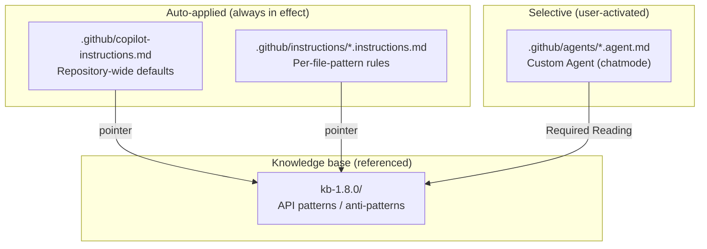
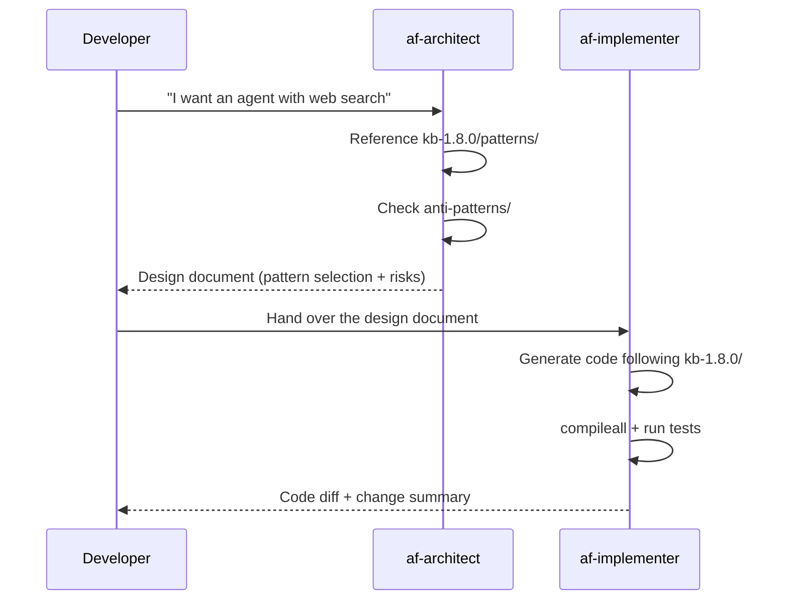

# Lab 1: Understand GitHub Copilot's Customization Mechanisms

## Goal of this Lab

- Understand the **two mechanisms** for customizing GitHub Copilot for a repository
  - **Custom Instructions** — rules that are always applied automatically
  - **Custom Agents** — specialist personas you select and use
- Read through the concrete files implemented in this repository

> [!NOTE]
> This Lab is an instructor-led explanation session. From Lab 2 onward, you build agents with Copilot on the assumption that the customizations introduced here are "in effect."

---

## 1-1. Big Picture: The Copilot Customization Hierarchy



| Mechanism | When it applies | Purpose |
|---|---|---|
| Custom Instructions | **Always automatic** — applied the moment a file is opened | Coding conventions, environment-variable rules, style guides |
| Custom Agents | **User-selected** — switched in the chatmode dropdown | Specialist tasks such as design review, implementation, operational triage |

---

## 1-2. Custom Instructions (`.github/instructions/`)

### How it works

Custom Instructions are **Markdown files with YAML front matter**. When Copilot starts in VS Code, it automatically loads the files under `.github/instructions/`.

```yaml
---
applyTo: "**/*.py"          # Which files this is active for (glob pattern)
description: "Description..."     # The text Copilot uses to decide "should I reference this rule now?"
---

# Write the rule body here in Markdown
```

**Two front-matter keys are all you need:**

| Key | Role | Example |
|---|---|---|
| `applyTo` | Specify the target with a glob pattern | `**` = all files, `**/*.py` = Python only |
| `description` | Copilot's decision input — the body is referenced when a matching question arrives | The longer it is the higher the accuracy, but it consumes context |

### The Instructions in this repository

| File | `applyTo` | Role |
|---|---|---|
| [`agent-framework-azure-ai-py.instructions.md`](../.github/instructions/agent-framework-azure-ai-py.instructions.md) | `**` | A **pointer** to Agent Framework API knowledge (the body lives in `kb-1.8.0/`) |
| [`python.instructions.md`](../.github/instructions/python.instructions.md) | `**/*.py` | Python coding conventions (type hints, async/await, handling of environment variables) |
| [`docs.instructions.md`](../.github/instructions/docs.instructions.md) | `**/*.md` | Markdown authoring conventions (language tags, callouts, link format) |

### Choosing `applyTo` patterns

| Pattern | Meaning | Use case |
|---|---|---|
| `**` | All files | Cross-repository rules (API knowledge, overall policy) |
| `**/*.py` | All Python files | Coding conventions |
| `**/*.md` | All Markdown files | Documentation style guide |
| `src/**/*.py` | Only Python under `src/` | Rules specific to production code |

> [!IMPORTANT]
> Because `applyTo: "**"` is **included in Copilot's context every time**, an overly long file body wastes tokens. The best practice is to place large knowledge in an external file such as `kb-1.8.0/` and keep the instruction a pointer (just indicating where to look).

### How `description` influences Copilot's decisions

```text
User's question
    ↓
Copilot matches each instruction's description
    ↓
High match → add the instruction body to context
No match → skip (save tokens)
```

**The way you write `description` determines accuracy:**
- ✅ Include concrete keywords (`FoundryChatClient`, `@tool`, `agent.run`)
- ✅ Enumerate "when to reference this" in task form
- ❌ Vague generalities ("Python best practices")

### Real example: the `description` of the API-knowledge pointer

```yaml
description: A skill for building Microsoft Foundry agents with the Microsoft Agent
  Framework Python SDK (agent-framework-foundry). Creating agents with FoundryChatClient /
  FoundryAgent, adding hosted tools (Code Interpreter / File Search / Web Search / ...)
  and function tools (@tool), local MCP integration (MCPStreamableHTTPTool, etc.),
  conversation continuation with AgentSession, ...
```

→ Thanks to this long description, when a question containing any of the above keywords arrives, the knowledge in `kb-1.8.0/` is automatically referenced.

---

## 1-3. Custom Agents (`.github/agents/`)

### How it works

Custom Agents are Markdown files that operate as **VS Code chatmodes**. The user selects them from the **chatmode dropdown** in the top left of Copilot Chat.

```yaml
---
name: af-architect              # The chatmode ID (shown in the dropdown)
description: "Persona description"    # The one-line description shown in the chatmode picker
tools: ["read", "search"]       # The tools it can use
infer: true                     # Whether to infer additional context from the workspace
---

# Write the persona's detailed instructions here (equivalent to a system prompt)
```

### The four front-matter keys

| Key | Type | Description |
|---|---|---|
| `name` | string | The chatmode ID — `[a-z][a-z0-9-]*`, kebab-case |
| `description` | string | Shown in the chatmode picker. Convey the persona and scope in one line |
| `tools` | list | A subset of `["read", "search", "edit", "execute"]` |
| `infer` | boolean | `true` = automatically infer context from the workspace |

> [!NOTE]
> `tools` is an **allow list**. `af-architect` has only `["read", "search"]` — it is intentionally designed to be unable to write code.

### The Agents in this repository

| Agent | File | Role | tools |
|---|---|---|---|
| **af-architect** | [`af-architect.agent.md`](../.github/agents/af-architect.agent.md) | Design advisor. Converts requirements into a design document with KB citations | `read`, `search` |
| **af-implementer** | [`af-implementer.agent.md`](../.github/agents/af-implementer.agent.md) | Implementation agent. Turns the design document into minimal-diff code | `read`, `search`, `edit`, `execute` |

### af-architect: Design advisor

**What it can do:**
- Listen to requirements and select an appropriate pattern from `kb-1.8.0/patterns/`
- Reference `kb-1.8.0/anti-patterns/` to warn about anti-patterns
- Output a **design document** that organizes the tool configuration, risks, and dependencies

**What it cannot do (intentional limits):**
- ❌ Write code (no `edit` permission)
- ❌ Run commands (no `execute` permission)
- ❌ Write files to disk

**Output format (fixed structure):**

```text
## Requirement Summary
## Pattern Selection       ← selection table with KB citations
## Tool Inventory          ← list of function tools / hosted tools / MCP
## Risk Register           ← risks and mitigations
## Implementation Scope    ← separation of MVP and Optional
## Hand-off                ← hand-off to af-implementer
```

### af-implementer: Implementation agent

**What it can do:**
- Receive the design document from `af-architect` and implement the code with a minimal diff
- Follow the patterns in `kb-1.8.0/` precisely
- Validate syntax with `python3 -m compileall` and, when possible, run tests

**Limits (rules to follow):**
- ❌ Do not write patterns that do not exist in the KB by guessing
- ❌ Do not use removed APIs (12 of them, such as `HostedWebSearchTool`)
- ❌ Do not arbitrarily change production-intended model names or regions

### The collaboration flow between the two Agents (hand-off)



**Key points:**
- The architect decides "**what to build**," and the implementer executes "**how to build it**"
- Since the architect can only read/search, there is no temptation to write code
- Since the implementer works faithfully to the KB, it does not use fictitious APIs

### The internal structure of an Agent body

Both Agents have the following **core sections** (the order is a contract):

| # | Section | Purpose |
|---:|---|---|
| 1 | Opening paragraph | The persona's self-introduction (one paragraph) |
| 2 | Objectives | Prioritized list of goals (3–5 items) |
| 3 | Accuracy and Version Awareness | KB paths to reference and the verification order |
| 4 | Workflow | Steps to follow for each request |
| 5 | Output Format | The fixed structure of the output |
| 6 | Quality Standards | Quality criteria |
| 7 | Restrictions | What must not be done |
| 8 | Hand-off | How to hand off to the next Agent |

---

## 1-4. Instructions vs Agents: When to Use Which

| Aspect | Custom Instructions | Custom Agents |
|---|---|---|
| Activation | **Automatic** (just open a file) | **Manual** (select a chatmode) |
| Scope | Controlled by file pattern (`applyTo`) | Active only while selected |
| Main purpose | Rules, conventions, knowledge pointers | Specialist tasks (design, implementation, review) |
| Output form | Functions as a "constraint" during code generation | Agent-specific structured output |
| Tool restriction | None (normal Copilot permissions) | Can be explicitly restricted with `tools` |
| Typical size | 50–100 lines (or a pointer) | 100–200 lines (detailed workflow definition) |

**Decision criteria:**

- "**A rule I always want followed in any file**" → Instructions
- "**Behave as a specialist for a specific task**" → Agents

---

## 1-5. Summary

| Keyword | Meaning |
|---|---|
| `.github/instructions/*.instructions.md` | Auto-applied rules — scoped with `applyTo` |
| `.github/agents/*.agent.md` | chatmode — a specialist persona you select and use |
| `description` | The basis on which Copilot decides "should I reference this?" |
| `tools` | The operations allowed for an Agent (read / search / edit / execute) |
| Pointer approach | Keep instructions light; separate the knowledge body into `kb-1.8.0/` |
| Hand-off | Pass deliverables between Agents, e.g., architect → implementer |

> [!TIP]
> From Lab 2 onward, you generate code directly in Copilot Chat. As you do, keep in mind that the Instructions you saw here (Python conventions, API knowledge) are **always in effect behind the scenes**. When you want to use a Custom Agent, you can select `af-architect` or `af-implementer` from the chatmode dropdown.

---

Next → [Lab 2: Build the Microsoft Release-News Agent with MAF](02-maf-agent-en.md)
