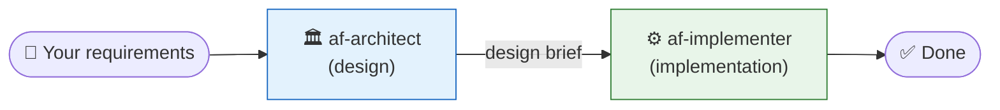

# Lab 2: Build the Microsoft Release-News Agent with MAF

## What you do in this Lab

**Using the Agent Skill you reviewed in Lab 1, you let Copilot build the agent.** You do not need to memorize the MAF API yourself. You only tell Copilot **what you want to build**, and the skill supplies the correct patterns behind the scenes.

The agent you will complete:

- **Name**: MS Updates Agent
- **Integrates with**: [Microsoft Release Communications MCP Server](https://learn.microsoft.com/en-us/microsoft-365/admin/manage/mrc-mcp?view=o365-worldwide)
- **Endpoint**: `https://www.microsoft.com/releasecommunications/mcp` (**no authentication required**)
- **Capabilities**: query the Microsoft 365 Message Center, Roadmap, Azure Updates, and Microsoft Learn in natural language

> In Lab 3 you deploy almost this exact code to a **Foundry Hosted Agent**. The design keeps the diff between the code you run in Lab 2 and the container `main.py` in Lab 3 to a minimum.

## Prerequisites

- In [Lab 0](00-setup-en.md), `.venv` is activated and `agent-framework-foundry` is installed (`from agent_framework.foundry import FoundryChatClient` succeeds)
- In [Lab 1](01-agent-skills-en.md), you confirmed the MAF × Foundry skill is recognized by Copilot
- `.env` has `FOUNDRY_PROJECT_ENDPOINT` and `FOUNDRY_MODEL` set

---

## 2-0. The chatmodes used in this Lab (recommended workflow)

In this Lab you switch between **two custom chatmodes** by phase. If you stay in the default Agent mode, the systematic loading of the KB (`kb-1.8.0/`) is not guaranteed, and you risk generating an API that was deprecated in 1.8.x (e.g., `async with FoundryChatClient(...)`). Switching chatmodes makes the "design → implementation" hand-off proceed mechanically.



| Chatmode | Role in this Lab | Sections used |
|---|---|---|
| **`af-architect`** | Convert requirements into a 7-section design brief (pattern selection, anti-pattern flags, risk register, open questions). Does not write code. | 2-1 (Step 1) |
| **`af-implementer`** | Generate minimal-diff code from the design brief using the canonical pattern (`client = FoundryChatClient(...)` → `async with client.as_agent(...)`). | 2-1 (Step 2) / 2-3 / 2-4 / 2-5 |

### How to switch chatmodes

In the Copilot Chat panel in VS Code Insiders:

1. Click the **chatmode picker at the bottom of the chat input box** (defaults to "Agent")
2. Select `af-architect` or `af-implementer` from the list
3. Enter your prompt and send

> [!TIP]
> After switching, you can confirm the current mode by the chatmode name in the top left of the panel. Use the following as a guide depending on the nature of the requirement:
> - **Requirement is vague / you are unsure which pattern to choose** → first have `af-architect` produce a design brief
> - **What to do is clear / extending existing code** → call `af-implementer` directly

---

## 2-1. Have Copilot Build the Agent Skeleton

In VS Code, create a new `src/agent.py` (if the `src/` folder does not exist, Copilot creates it).

### Step 1 — Create a design brief with `af-architect`

In the Copilot Chat chatmode picker, switch to **`af-architect`**, open the chat input with `Ctrl+Alt+I`, and enter the following:

````text
I want to build an agent that answers about the latest Microsoft 365 and Azure release information.

Requirements:
- Implemented with the Microsoft Agent Framework Python SDK
- Connects to Microsoft Foundry (pass project_endpoint and model via .env)
- Agent name is "MSUpdatesAgent"
- Integrates with the Microsoft Release Communications MCP (https://www.microsoft.com/releasecommunications/mcp, no authentication required)
- Always uses the MRC MCP tools and includes source URLs in answers
- Runs as a local CLI via python src/agent.py

Please produce a design brief.
````

`af-architect` systematically reads `kb-1.8.0/` and returns a design brief like the following (verified on a real machine):

| Brief section | Example expected content |
|---|---|
| **Pattern Selection** | Adopt `kb-1.8.0/patterns/canonical-agent-creation.md` (Foundry + as_agent); judge that `kb-1.8.0/patterns/structured-output-pydantic.md` is not needed this time |
| **Anti-pattern flags** | `missing-async-with-cleanup.md` (FoundryChatClient is not an async CM) / `sync-credential-in-async.md` (enforce async cred) / `empty-env-vars-codespaces.md` (guard against empty `.env` strings) |
| **Tool inventory** | Select `MCPStreamableHTTPTool` (`kb-1.8.0/api-reference/1.8.0/tools-mcp.md`); stability tier is Stable |
| **Risk register** | mcp package optional extra / risk of misusing async with on FoundryChatClient / model deployment name mismatch |
| **Open questions** | Whether session continuation is needed / whether streaming output is needed / format of source URLs |
| **Hand-off** | → `af-implementer` |

### Step 2 — Generate code with `af-implementer`

In the chatmode picker, switch to **`af-implementer`** and, building on af-architect's design brief, enter the following:

````text
Following af-architect's design brief, create a new src/agent.py.
Strictly follow the canonical pattern and the Code Generation Cheat Sheet.
````

`af-implementer` reads [kb-1.8.0/README.md](../kb-1.8.0/README.md), [kb-1.8.0/api-reference/1.8.0/tools-mcp.md](../kb-1.8.0/api-reference/1.8.0/tools-mcp.md), [kb-1.8.0/api-reference/1.8.0/tools-function.md](../kb-1.8.0/api-reference/1.8.0/tools-function.md), and [kb-1.8.0/patterns/canonical-agent-creation.md](../kb-1.8.0/patterns/canonical-agent-creation.md), and auto-completes the following:

- Loads `.env` with `python-dotenv` and takes the Foundry project endpoint and model deployment name from environment variables
- Because it runs as a local CLI, authentication uses the **async version** `from azure.identity.aio import AzureCliCredential` (using the sync version in an async context blocks the event loop, which is prohibited in `kb-1.8.0/anti-patterns/sync-credential-in-async.md`)
- The canonical pattern: `client = FoundryChatClient(...)` → `async with client.as_agent(name=..., instructions=..., tools=[...]) as agent:` (`FoundryChatClient` itself is **not** an async context manager, so writing `async with FoundryChatClient(...)` fails with `TypeError: missed __aexit__`. See `kb-1.8.0/anti-patterns/missing-async-with-cleanup.md`)
- Because the instructions contain the MCP URL ([inference rule in tools-mcp.md](../kb-1.8.0/api-reference/1.8.0/tools-mcp.md#ユーザー指示からの推論ルール)), it generates `MCPStreamableHTTPTool` and passes it to `tools=` (it is automatically entered/exited by the agent's `async with`)
- `main()` is `async def` + `asyncio.run(main())`. If there is a CLI argument, it uses it as the question; otherwise it uses a reasonable sample question

> [!IMPORTANT]
> **Mistakes that commonly creep into generated code** (prevented by af-implementer's [Code Generation Cheat Sheet](../.github/agents/af-implementer.agent.md), but verify them yourself too):
> 1. **Wrapping FoundryChatClient in async with**: writing `async with FoundryChatClient(...) as client:` causes a runtime `TypeError`. The correct form is `client = FoundryChatClient(...)` (assignment only) → `async with client.as_agent(...) as agent:`
> 2. **The `mcp` package is not installed**: `MCPStreamableHTTPTool` lazily imports `mcp` at runtime, but a bare install does not include it. Confirm you ran `pip install mcp` in Lab 0 (details: [tools-mcp.md](../kb-1.8.0/api-reference/1.8.0/tools-mcp.md))

Roughly the following code is generated (the canonical pattern, verified on a real machine):

```python
import asyncio
import os
import sys

from agent_framework import MCPStreamableHTTPTool
from agent_framework.foundry import FoundryChatClient
from azure.identity.aio import AzureCliCredential  # ← explicitly the async version
from dotenv import load_dotenv

load_dotenv()

INSTRUCTIONS = """You are an assistant that answers about the latest Microsoft 365 and Azure release information. Always use the MRC MCP tools (https://www.microsoft.com/releasecommunications/mcp) to retrieve information, and include source URLs in your answers."""

MCP_URL = "https://www.microsoft.com/releasecommunications/mcp"


async def main() -> None:
    query = sys.argv[1] if len(sys.argv) > 1 else \
        "Tell me 3 Azure AI-related updates that reached GA this quarter"

    mrc_mcp = MCPStreamableHTTPTool(name="MRC", url=MCP_URL)

    # canonical pattern: credential with async with, client assigned directly, agent with async with
    async with AzureCliCredential() as credential:
        client = FoundryChatClient(
            project_endpoint=os.environ["FOUNDRY_PROJECT_ENDPOINT"],
            model=os.environ["FOUNDRY_MODEL"],
            credential=credential,
        )
        async with client.as_agent(
            name="MSUpdatesAgent",
            instructions=INSTRUCTIONS,
            tools=[mrc_mcp],
        ) as agent:
            response = await agent.run(query)
            print(response.text)


if __name__ == "__main__":
    asyncio.run(main())
```

> **This is the value of chatmode + KB.** You only wrote the requirements (connection target, instructions, integration tool), yet `af-architect` handed off the design decisions (pattern selection, risk register, anti-pattern flags) to `af-implementer`, and `af-implementer` filled in the authentication class, environment-variable names, the use of `async with`, and the CLI skeleton from the KB. You do not need to memorize the fine details of the SDK API.

---

## 2-2. Run It

> [!IMPORTANT]
> **Pre-run checks** (points that actually tripped people up during real testing):
> 1. **Confirm the venv is activated**: `(.venv)` appears at the start of the prompt
>    - Bash/Zsh: `source .venv/bin/activate`
>    - **Fish**: `source .venv/bin/activate.fish` (← just `activate` errors with `Unsupported use of '='`)
>    - PowerShell: `.\.venv\Scripts\Activate.ps1`
> 2. **Confirm the `mcp` package is installed**: `python -c "from mcp.client.streamable_http import streamable_http_client; print('ok')"` prints `ok`. If not, run `pip install mcp` (should already be installed from Lab 0)
> 3. **Confirm you have run `az login`**: `az account show` prints your account info

```bash
python src/agent.py
```

A response comes back in a few seconds to a few tens of seconds.

Specifying a question:

```bash
python src/agent.py "List 5 Outlook-related items from the Microsoft 365 Copilot roadmap"
```

### Common errors

| Error | Cause / fix |
|---|---|
| `KeyError: 'FOUNDRY_PROJECT_ENDPOINT'` | `.env` was not loaded. Confirm `load_dotenv()` is called at the top of the script |
| `TypeError: 'FoundryChatClient' object does not support the asynchronous context manager protocol (missed __aexit__ method)` | You wrote `async with FoundryChatClient(...)`. `FoundryChatClient` is not an async CM. Fix it to the chain pattern `client = FoundryChatClient(...)` (assignment only) → `async with client.as_agent(...) as agent:` (details: [`missing-async-with-cleanup.md`](../kb-1.8.0/anti-patterns/missing-async-with-cleanup.md), [af-implementer's Code Generation Cheat Sheet](../.github/agents/af-implementer.agent.md)) |
| `ModuleNotFoundError: 'MCPStreamableHTTPTool' requires 'mcp'. Please install 'mcp'.` | The `mcp` package is not installed. Run `pip install mcp` (should already be installed from Lab 0). Caused by a lazy import that `compileall` does not catch (details: top of [`tools-mcp.md`](../kb-1.8.0/api-reference/1.8.0/tools-mcp.md)) |
| `Unsupported use of '='` (Fish shell) | `source .venv/bin/activate` fails in Fish. Use `source .venv/bin/activate.fish` instead |
| `DefaultAzureCredentialError` / 401 / 403 | `az login` not run, wrong tenant, or insufficient `Foundry User` role. Re-check 0-2 in Lab 0 |
| `ChatClientInvalidResponseException: Failed to resolve model info` | `FOUNDRY_MODEL` in `.env` does not match the actual deployment name. Check in the Foundry portal `Models + endpoints` |
| `Tool 'search_microsoft_*' not found` | The MCP URL is wrong. Re-check `https://www.microsoft.com/releasecommunications/mcp` |
| The MCP tool is not called | In `instructions`, state explicitly "**always use the MCP tools** to retrieve information and do not answer from guesses." Adding "if the result is empty, answer 'no information found'" improves it further |

---

## 2-3. Extend to Conversation Continuation + Streaming

In the Copilot Chat chatmode picker, switch to **`af-implementer`** (this is an extension of an already-working MVP, so no new design decisions are needed; you do not need to go through `af-architect`):

````text
Rewrite src/agent.py into an "interactive mode that continues the conversation."
- Reuse the same session to retain context
- Display responses incrementally via streaming
- Show the conversation ID at the start of each turn in the form "[conv:xxxx]"
- Keep the canonical pattern (client = FoundryChatClient + async with client.as_agent)
````

`af-implementer` references `kb-1.8.0/api-reference/1.8.0/sessions.md` and completes the default behavior—"exit the loop on a termination word (quit/exit/終了)," "create `agent.create_session()` only once at the start of the conversation," "loop `agent.run(prompt, stream=True, session=session)` with `async for chunk`"—rewriting it into roughly the following structure (reflecting the canonical pattern):

```python
async def main() -> None:
    mrc_mcp = MCPStreamableHTTPTool(name="MRC", url=MCP_URL)

    async with AzureCliCredential() as credential:
        client = FoundryChatClient(
            project_endpoint=os.environ["FOUNDRY_PROJECT_ENDPOINT"],
            model=os.environ["FOUNDRY_MODEL"],
            credential=credential,
        )
        async with client.as_agent(
            name="MSUpdatesAgent",
            instructions=INSTRUCTIONS,
            tools=[mrc_mcp],
        ) as agent:
            session = agent.create_session()

            print("MS Updates Agent. Enter your question (quit/exit to finish)")
            while True:
                user_input = input("\nYou: ").strip()
                if user_input.lower() in {"quit", "exit", "終了"}:
                    break
                if not user_input:
                    continue

                print(f"\n[conv:{getattr(session, 'conversation_id', 'pending')}]")
                print("Agent: ", end="", flush=True)
                stream = agent.run(user_input, stream=True, session=session)
                async for chunk in stream:
                    if chunk.text:
                        print(chunk.text, end="", flush=True)
                print()
```

### Run it

```bash
python src/agent.py
```

Example dialogue:

```text
You: Tell me 3 Azure AI-related updates that reached GA this quarter
Agent: 1. The XX feature of Azure AI Foundry (GA YYYY-MM-DD)... [URL]
       2. ...

You: Tell me more about the first update
Agent: (drills down by referencing the previous turn)
```

If the context carries over, the session works.

---

## 2-4. ★Stretch: Turn It into a Report with Structured Output

For cases where, instead of a "natural-language response," you want to receive a **Pydantic model** and feed it to downstream processing (email creation, Slack posting, CI evaluators, etc.).

In the Copilot Chat chatmode picker, switch to **`af-implementer`**:

````text
Create a new src/report.py.
- Same agent configuration as src/agent.py (uses the MRC MCP)
- Structure the Microsoft 365 and Azure release report with Pydantic
- The top level is period(str) / summary(str) / items(list)
- Each item has product / title / status / released_at / url / summary
- The question is "Structure the 5 major Microsoft 365 / Azure updates that recently reached GA"
- Save the result to data/report_<date>.json
- Strictly follow the canonical pattern (client = FoundryChatClient + async with client.as_agent)
````

Run it (`mkdir -p` works in both PowerShell and bash):

```bash
mkdir -p data
python src/report.py
```

> `af-implementer` references [kb-1.8.0/patterns/structured-output-pydantic.md](../kb-1.8.0/patterns/structured-output-pydantic.md) and completes the pattern of `options={"response_format": MyModel}` and receiving `response.value` in a `try/except ValidationError`. It matches the output file name to the workshop convention of `data/<naming>_<date>.json`. Structured output has the big advantage of being **easy for a CI/CD evaluator to read**. You reuse it in Lab 4 / Lab 5.

---

## 2-5. ★Stretch: Combine with Web Search

The MCP has Microsoft 365 / Azure Updates / Roadmap / Learn information, so it covers most cases, but if you want to pull **individual blog posts or StackOverflow**, you can add Foundry's Hosted Web Search (**works only with Azure OpenAI models**).

In the Copilot Chat chatmode picker, switch to **`af-implementer`**:

```text
Add FoundryChatClient.get_web_search_tool() to the tools in src/agent.py, and
append to instructions: "In addition to the primary information obtained via MCP,
you may use web search when looking for supplements or related blogs."
```

---

## Summary

- With the combination of **chatmode + KB**, you can write correct code without memorizing the fine API of the SDK
- 1.8.x canonical pattern: `client = FoundryChatClient(...)` (assignment only) → `async with client.as_agent(...) as agent:` (chain)
- In an async context, always use `from azure.identity.aio import AzureCliCredential` (sync version prohibited)
- When you extend features one after another (session, streaming, structured output), **instructing in natural language** lets the KB pull the appropriate reference behind the scenes
- The `src/agent.py` you completed is deployed almost as is to a Foundry Hosted Agent in the next Lab 3

### Roles of the chatmodes used in this Lab

| Phase | Chatmode | What it did |
|---|---|---|
| Design | `af-architect` | Decompose requirements into pattern selection + anti-pattern flags + risk register (2-1 Step 1) |
| Implementation | `af-implementer` | Pull the canonical pattern from the KB and generate code with a minimal diff (2-1 Step 2 / 2-3 / 2-4 / 2-5) |

> [!TIP]
> **There is still a possibility that bugs creep into Copilot's output** (for example, real-machine testing observed it generating `async with FoundryChatClient(...)`, which was deprecated in 1.8.x). Within Lab 2, the "IMPORTANT callout in 2-1" and the "common-errors table in 2-2" are the main lines of defense. Always visually verify the generated code before running it on a real machine. The **Code Generation Cheat Sheet** section of `af-implementer` enumerates the correct patterns, so use it as a checklist.

---

Next → [Lab 3: Deploy the Hosted Agent to Foundry](03-foundry-deploy-en.md)
